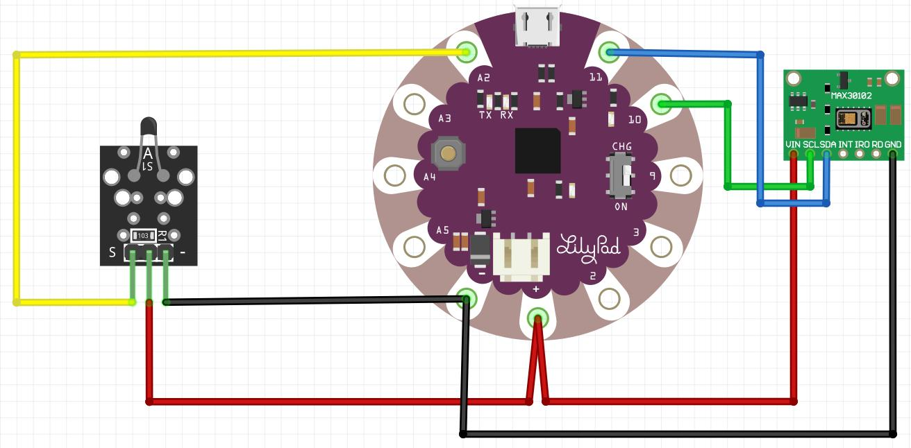

# Proyecto Equipo Final: Sensor de signos vitales para bebé

## Descripción

El proyecto consiste en un sensor de signos vitales para bebé, que se conecta a travez de un lilypad que con la ayuda de un cable usb, permite mostrar los datos de temperatura, presión arterial, pulso y oxigenación.

## Requisitos

- Lilypad con salida micro usb.
- Cable usb con entrada micro usb
- 7 cables caimanes con salida hembra.
- KY-013
- MAX30102 5 PINES.

## Esquema de diseño



## Código fuente del software

```c++
#include <Wire.h>
#include "MAX30100_PulseOximeter.h"
 
#define REPORTING_PERIOD_MS 1000
int ThermistorPin = A2;
int Vo;
float R1 = 10000; // value of R1 on board
float logR2, R2, T;
float c1 = 0.001129148, c2 = 0.000234125, c3 = 0.0000000876741; //steinhart-hart coeficients for thermistor
// PulseOximeter is the higher level interface to the sensor
// it offers:
// * beat detection reporting
// * heart rate calculation
// * SpO2 (oxidation level) calculation
PulseOximeter pox;
 
uint32_t tsLastReport = 0;
 
// Callback (registered below) fired when a pulse is detected
void onBeatDetected()
{
Serial.println("Beat!");
  Vo = analogRead(ThermistorPin);
  R2 = R1 * (1023.0 / (float)Vo - 1.0); //calculate resistance on thermistor
  logR2 = log(R2);
  T = (1.0 / (c1 + c2*logR2 + c3*logR2*logR2*logR2)); // temperature in Kelvin
  T = T - 273.15; //convert Kelvin to Celcius
 // T = (T * 9.0)/ 5.0 + 32.0; //convert Celcius to Farenheit
  Serial.print("Temperature: "); 
  Serial.print(T);
  Serial.println(" C");
}
 
void setup()
{
Serial.begin(115200);
 
Serial.print("Initializing pulse oximeter..");
 
// Initialize the PulseOximeter instance
// Failures are generally due to an improper I2C wiring, missing power supply
// or wrong target chip
if (!pox.begin()) {
Serial.println("FAILED");
for(;;);
} else {
Serial.println("SUCCESS");
}
 
// The default current for the IR LED is 50mA and it could be changed
// by uncommenting the following line. Check MAX30100_Registers.h for all the
// available options.
// pox.setIRLedCurrent(MAX30100_LED_CURR_7_6MA);
 
// Register a callback for the beat detection
pox.setOnBeatDetectedCallback(onBeatDetected);
}
 
void loop()
{
  
  // Make sure to call update as fast as possible
  pox.update();
   
  // Asynchronously dump heart rate and oxidation levels to the serial
  // For both, a value of 0 means "invalid"
  if (millis() - tsLastReport > REPORTING_PERIOD_MS) {
    Serial.print("Heart rate:");
    Serial.print(pox.getHeartRate());
    Serial.print("bpm / SpO2:");
    Serial.print(pox.getSpO2());
    Serial.println("%");
     
    tsLastReport = millis();
  }
  
}
```
